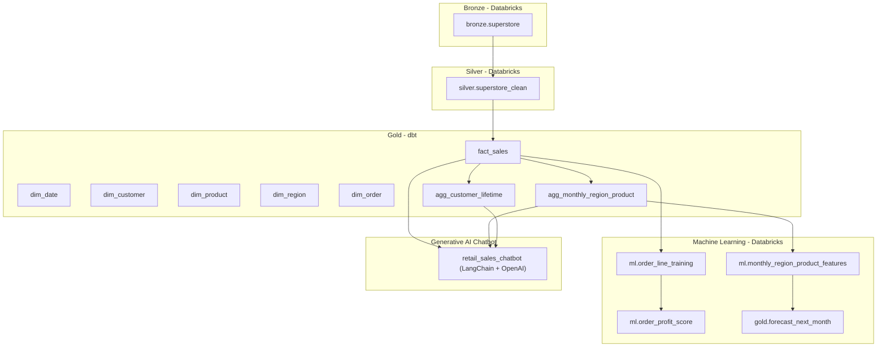
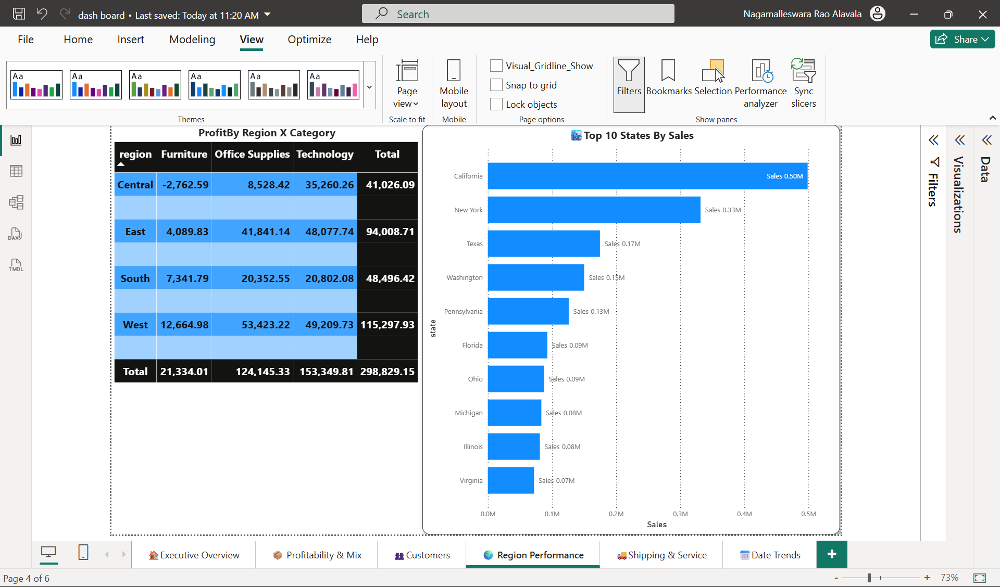
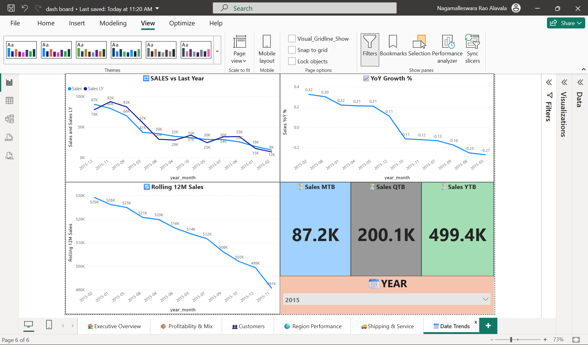

# 🛒 Retail Sales Analytics & Forecasting

**Repository:** `nalavala999/retail_sales_analytics_and_forecasting`  
**Author:** Nagamalleswara Rao Alavala  
**Date:** 2025-11-05  


---

## 📘 Table of Contents
1. [Project Overview](#project-overview)  
2. [Architecture & Data Flow](#architecture--data-flow)  
3. [Data Lineage](#data-lineage)  
4. [Conceptual Mapping to Retail Tables](#conceptual-mapping-to-retail-tables)  
5. [Gold Layer Models](#gold-layer-models)  
6. [ETL Summary](#etl-summary)  
7. [Power BI Deliverables](#power-bi-deliverables)  
8. [Machine Learning Models](#machine-learning-models)  
9. [Gen-AI Chatbot](#gen-ai-chatbot)  
10. [CI/CD & Quality](#cicd--quality)  
11. [Repo Structure](#repo-structure)  
12. [How to Run (Quickstart)](#how-to-run-quickstart)  
13. [Troubleshooting](#troubleshooting)  
14. [Next Steps](#next-steps)  
15. [Dataset & Credits](#dataset--credits)

---

## 🧩 Project Overview
End-to-end **retail sales analytics and forecasting** pipeline built using the Kaggle *Superstore* dataset.  
This solution models data through the **Medallion Architecture** (Bronze → Silver → Gold), powers **Power BI dashboards**, and includes **ML & Gen-AI** components.

### Objectives
- Design relational schema for Orders, Customers, Products, Regions, and SalesFacts  
- Build ETL pipelines with **Databricks + dbt**  
- Create dashboards for **sales trend, profit heatmap, customer analysis**  
- Develop **ML models** for forecasting & profitability classification  
- Build a **Gen-AI chatbot** to query sales data using natural language  

---

## 🧱 Architecture & Data Flow

| Layer | Platform | Schema | Description |
|-------|-----------|---------|-------------|
| **Bronze** | Databricks | `bronze` | Raw CSV → Delta (immutable) |
| **Silver** | Databricks | `silver` | Cleaned, typed, deduped data with derived fields |
| **Gold** | dbt + Delta | `gold` | Dimensional models (dims, facts, aggs, views) |
| **ML** | Databricks | `ml` | Feature engineering & model outputs |
| **BI** | Power BI | — | Dashboards for visualization |
| **AI** | LangChain + OpenAI | — | Natural Language Chatbot for query automation |

---

## 🧭 Data Lineage



---

## 🧠 Conceptual Mapping to Retail Tables

| Concept | Implemented In | Description |
|----------|----------------|-------------|
| **Orders** | `dim_order`, `fact_sales` | Order header, shipping info, and performance |
| **Customers** | `dim_customer`, `agg_customer_lifetime` | Customer demographics & segment |
| **Products** | `dim_product`, `agg_monthly_region_product` | Category hierarchy and sales contribution |
| **Regions** | `dim_region`, `agg_monthly_region_product` | Geographical dimension for KPIs |
| **SalesFacts** | `fact_sales` | Central fact table with all business measures |

---

## 🧱 Gold Layer Models

| Type | Model | Description |
|------|--------|-------------|
| **Dimension** | `dim_date` | Calendar (year, quarter, month, week) |
| **Dimension** | `dim_customer` | Customer attributes & segments |
| **Dimension** | `dim_product` | Product attributes & sub-categories |
| **Dimension** | `dim_region` | Regional hierarchy |
| **Fact** | `fact_sales` | Core metrics: Sales, Profit, Quantity, Discount |
| **Agg** | `agg_monthly_region_product` | Monthly Region × Category × SubCategory metrics |
| **Agg** | `agg_customer_lifetime` | Lifetime KPIs for each customer |
| **View** | `v_fact_sales`, `v_dim_*` | BI consumption layer |
| **ML Output** | `gold.forecast_next_month`, `ml.order_profit_score` | ML results for BI integration |

---

## ⚙️ ETL Summary

| Step | Task | Tools |
|------|------|-------|
| **1. Raw Ingestion** | Import CSVs from Kaggle → Bronze | Databricks COPY INTO |
| **2. Data Cleaning** | Trim, cast types, remove nulls | PySpark |
| **3. Transformation** | Enrich with derived metrics | Databricks SQL |
| **4. Modeling** | Build Star Schema | dbt |
| **5. Validation** | Run dbt tests (unique, not_null) | dbt |
| **6. Delivery** | Power BI dashboards, ML, and Chatbot | Power BI + LangChain |

---

## 📊 Power BI Analytics & Visualization  

### 🎯 Dashboard Pages Overview  

| Page | Purpose | Key Visuals |
|------|----------|-------------|
| **🏠 Executive Overview** | Executive summary of business KPIs | KPIs: Total Sales, Profit, Margin %, Orders, AOV |
| **🌍 Region Performance** | Regional comparison & performance tracking | Map/Bar: Sales by Region, Profit by Region, Margin Heatmap |
| **📦 Profitability & Mix** | Category-level profitability insights | Matrix: Region × Category (Profit, Margin%), Top N Products |
| **👥 Customers** | Customer lifetime and segmentation insights | Table: LTV Metrics (Orders, Sales, Profit), Bar: Sales by Segment |
| **🚚 Shipping & Service** | Shipping efficiency and delivery impact | Bar: Ship Mode vs Margin, Speed Bucket vs Profit, Avg Ship Days |
| **📅 Date Trends** | Time-based trend analysis | Line: Monthly Sales, Profit, YoY Growth, Rolling 12M Sales |

---

### 🖼️ Dashboard Previews  

#### 🏠 Executive Overview


#### 🌍 Region Performance


#### 📦 Profitability & Mix


#### 👥 Customers


#### 🚚 Shipping & Service


#### 📅 Date Trends


---

### 🧮 Key DAX Measures

```DAX
Total Sales = SUM(fact_sales[sales])
Total Profit = SUM(fact_sales[profit])
Total Orders = DISTINCTCOUNT(fact_sales[order_id])
Units Sold = SUM(fact_sales[quantity])

Margin % =
DIVIDE([Total Profit], [Total Sales], 0)

Average Order Value (AOV) =
DIVIDE([Total Sales], [Total Orders], 0)

Sales LY =
CALCULATE([Total Sales], DATEADD(dim_date[date], -1, YEAR))

Sales YoY % =
DIVIDE([Total Sales] - [Sales LY], [Sales LY], 0)

Rolling 12M Sales =
CALCULATE([Total Sales], DATESINPERIOD(dim_date[date], MAX(dim_date[date]), -12, MONTH))

Top Customer Sales =
CALCULATE([Total Sales], TOPN(10, dim_customer, [Total Sales]))

Average Ship Days =
AVERAGE(dim_order[ship_days])
```

---


## 🤖 Machine Learning Models

| Model | Input Table | Objective | Output Table |
|--------|--------------|------------|---------------|
| **Classification (Profitable Orders)** | `ml.order_line_training` | Predict if an order is profitable | `ml.order_profit_score` |
| **Regression (Next-Month Sales Forecast)** | `ml.monthly_region_product_features` | Forecast next month’s sales per Region×Category | `gold.forecast_next_month` |

> **Tools:** scikit-learn (pandas) — Logistic Regression, Linear/Gradient Boosting Regressors  
> **Validation Metrics:** Accuracy, ROC-AUC (classification); MAE, RMSE, R², MAPE (regression)

---

## 🧠 Gen-AI Chatbot

| Aspect | Description |
|---------|-------------|
| **Goal** | Enable business users to query retail insights conversationally |
| **Framework** | LangChain + OpenAI (GPT-5) |
| **Data Source** | Gold tables in Databricks SQL |
| **Orchestration** | Python-based retrieval using SQL connectors |
| **Features** | |
| → Text-to-SQL translation | Natural language → SQL → Databricks results |
| → Context memory | Multi-turn query understanding |
| → Metrics lookup | Fetches key KPIs dynamically (sales, profit, YoY growth) |
| → Power BI integration | Embed in dashboard for conversational analytics |

**Example Queries**
```
"Show total sales in West region for 2017"
"Compare profit margin between Technology and Furniture"
"Which customer segment had highest growth last quarter?"
"Forecast next month sales for South region"
```

**Implementation Folder**
```
chatbot/
├── retail_chatbot.py          # LangChain pipeline
├── sql_agent.py               # SQL query execution layer
├── prompt_templates.py        # Custom prompts for retail queries
└── requirements.txt           # Dependencies
```

---

## 🧪 CI/CD & Quality

- **dbt tests:** `unique`, `not_null`, `relationships`  
- **Contracts:** schema enforcement on key tables  
- **GitHub Actions:** auto-run dbt + ML pipelines (future)  
- **Power BI refresh:** scheduled daily sync from Databricks  

---

## 📂 Repository Structure
```
📦 retail_sales_analytics_and_forecasting
├── databricks/
│   ├── bronze/
│   ├── silver/
│   ├── gold/
│   └── ml_sql/
├── dbt/
│   ├── models/
│   │   ├── gold/
│   │   └── sources/
│   └── dbt_project.yml
├── ML Models/
│   ├── notebooks/
│   ├── nb01_profitable_orders_lr_sklearn.py
│   ├── nb02_profitable_orders_rf_sklearn.py
│   ├── nb03_next_month_sales_gbr_sklearn.py
│   └── nb04_next_month_sales_linear_sklearn.py
├── chatbot/
│   ├── retail_chatbot.py
│   ├── sql_agent.py
│   └── prompt_templates.py
├── powerbi/
│   ├── Retail_Superstore.pbix
│   └── assets/
│       ├── overview.png
│       ├── profitability.png
│       ├── customers.png
│       └── shipping.png
├── LICENSE
└── README.md
```

---

## 🚀 How to Run (Quickstart)

**1️⃣ Databricks**
```bash
# Ingest + Clean
run bronze/superstore_ingest.py
run silver/superstore_clean_transform.py
```

**2️⃣ dbt**
```bash
dbt deps
dbt build --select path:dbt/models/gold
```

**3️⃣ ML (in Databricks notebooks)**
- Run classification/regression notebooks in `/ML Models/notebooks/`
- Output stored in `ml.order_profit_score` & `gold.forecast_next_month`

**4️⃣ Chatbot**
```bash
pip install -r chatbot/requirements.txt
python chatbot/retail_chatbot.py
```

**5️⃣ Power BI**
- Connect to Databricks SQL endpoint (Gold schema)
- Import measures and visuals for the dashboard

---

## 🛠️ Troubleshooting

| Issue | Fix |
|-------|-----|
| Delta field merge errors (`order_date`, `ym`) | Cast to DATE before write |
| `OneHotEncoder` sparse arg error | Use `sparse_output=False` |
| NaN handling in sklearn | Add `SimpleImputer` to pipeline |
| Large quantity/discount anomalies | Recheck join keys in `fact_sales` |

---

## 🔮 Next Steps
- Integrate **chatbot responses directly into Power BI dashboards**
- Add **RAG-based** architecture for question answering over aggregated metrics
- Deploy **ML model endpoints** (Databricks REST or Azure ML)
- Automate nightly dbt + ML model runs with GitHub Actions

---

## 📚 Dataset & Credits
- **Dataset:** [Kaggle — Superstore Dataset](https://www.kaggle.com/datasets/vivek468/superstore-dataset-final)  
- **Inspired by:** Healthcare Risk Prediction & Retail AI Analytics frameworks  
- **Developed by:** Nagamalleswara Rao Alavala (2025)
