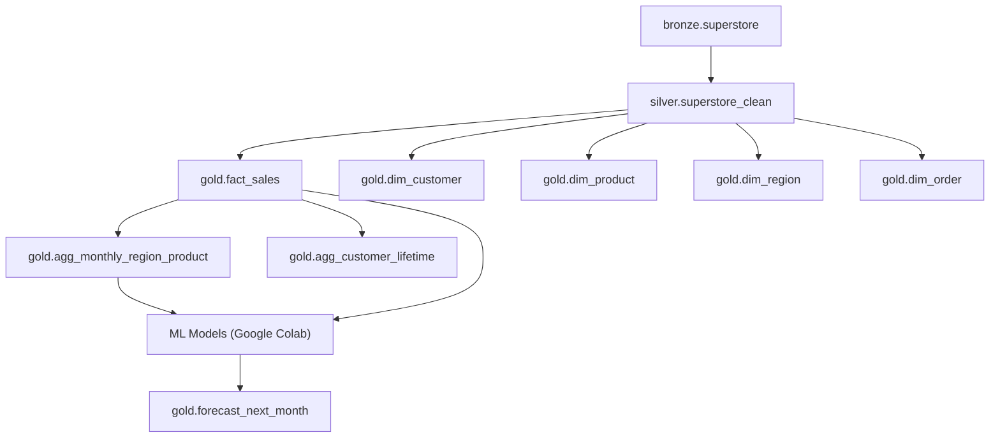

# 🛒 Retail Sales Analytics & Forecasting  

**Repository:** `nalavala999/retail_sales_analytics_and_forecasting`  
**Author:** Nagamalleswara Rao Alavala  
**Date:** 2025-11-07  

---

## 📘 Table of Contents
1. [Project Overview](#project-overview)  
2. [Architecture & Data Flow](#architecture--data-flow)  
3. [Data Lineage](#data-lineage)  
4. [Conceptual Mapping to Retail Tables](#conceptual-mapping-to-retail-tables)  
5. [Gold Layer Models](#gold-layer-models)  
6. [ETL Summary](#etl-summary)  
7. [Power BI Deliverables](#power-bi-deliverables)  
8. [Machine Learning Models (Google Colab)](#machine-learning-models-google-colab)  
9. [Gen-AI Chatbot (Planned)](#gen-ai-chatbot-planned)  
10. [Repo Structure](#repo-structure)  
11. [Next Steps](#next-steps)  
12. [Dataset & Credits](#dataset--credits)  

---

## 🧩 Project Overview  
An end-to-end **Retail Sales Analytics & Forecasting** pipeline built using the **Kaggle Superstore dataset**.  
Implements the **Medallion Architecture (Bronze → Silver → Gold)** in **Databricks + dbt**, visualized via **Power BI**, and extended with **ML models in Google Colab**.

---

## 🧱 Architecture & Data Flow  

| Layer | Platform | Schema | Description |
|-------|-----------|---------|-------------|
| **Bronze** | Databricks | `bronze` | Raw data ingestion from CSV → Delta |
| **Silver** | Databricks | `silver` | Cleaned, typed, deduplicated dataset |
| **Gold** | dbt | `gold` | Star schema — dimensions, facts, and aggregates |
| **ML** | Google Colab | — | ML models built using scikit-learn |
| **BI** | Power BI | — | Interactive visualizations & KPI dashboards |

---

## 🧭 Data Lineage  



---

## 🧠 Conceptual Mapping to Retail Tables  

| Concept | Implemented In | Description |
|----------|----------------|-------------|
| **Orders** | `dim_order`, `fact_sales` | Order header, dates, and ship info |
| **Customers** | `dim_customer`, `agg_customer_lifetime` | Customer attributes & segment |
| **Products** | `dim_product`, `agg_monthly_region_product` | Category hierarchy & product performance |
| **Regions** | `dim_region`, `agg_monthly_region_product` | Country/Region-level analysis |
| **SalesFacts** | `fact_sales` | Line-grain sales, profit, quantity, discount |

---

## 🧱 Gold Layer Models  

| Type | Model | Description |
|------|--------|-------------|
| **Dimension** | `dim_date` | Calendar hierarchy |
| **Dimension** | `dim_customer` | Customer profile & segment |
| **Dimension** | `dim_product` | Product and sub-category details |
| **Dimension** | `dim_region` | Region, state, city info |
| **Fact** | `fact_sales` | Core business metrics |
| **Aggregate** | `agg_monthly_region_product` | Region × Category × Month trends |
| **Aggregate** | `agg_customer_lifetime` | Lifetime metrics (Orders, Profit, Margin%) |
| **View** | `v_fact_sales`, `v_dim_*` | BI-ready thin views |

---

## ⚙️ ETL Summary  

| Step | Description | Tools |
|------|--------------|-------|
| 1️⃣ **Raw Ingestion** | Import CSVs → Bronze | Databricks COPY INTO |
| 2️⃣ **Transformation** | Clean & normalize | PySpark |
| 3️⃣ **Modeling** | Build dimensional schema | dbt |
| 4️⃣ **Validation** | dbt tests (not_null, unique) | dbt |
| 5️⃣ **Delivery** | Power BI dashboards | Power BI Service |
| 6️⃣ **ML & AI** | Forecasting & chatbot modules | Google Colab + LangChain |

---

## 📊 Power BI Deliverables  

| Page | Purpose | Key Visuals |
|------|----------|-------------|
| 🏠 **Executive Overview** | Summary KPIs | Total Sales, Profit, Orders, AOV |
| 🌍 **Region Performance** | Regional comparison | Map + Bar Charts |
| 📦 **Profitability & Mix** | Category-level profitability | Matrix (Region × Category) |
| 👥 **Customers** | Segment & LTV insights | Bar + Table Visuals |
| 🚚 **Shipping & Service** | Operational efficiency | Ship Mode vs Profit |
| 📅 **Date Trends** | Time-based trends | Line Charts – Monthly Sales/Profit |

### 📸 Dashboard Previews  
#### 🏠 Executive Overview


#### 🌍 Region Performance


#### 📦 Profitability & Mix


#### 👥 Customers


#### 🚚 Shipping & Service


#### 📅 Date Trends


---

## 🤖 Machine Learning Models (Google Colab)

[](https://colab.research.google.com/github/nalavala999/retail_sales_analytics_and_forecasting/blob/main/ML_Models/sales_forecast.ipynb)

**Notebook:** `sales_forecast.ipynb`  
**Dataset:** `Cleaned_Superstore.csv`

| Model | Type | Algorithm | Metric | Result |
|--------|------|------------|---------|---------|
| **Profitable Orders Classifier** | Classification | Logistic Regression / Random Forest | Accuracy | ≈ 92–94 % |
| **Next-Month Sales Forecast** | Regression | Linear & Gradient Boosting Regressor | R² | ≈ 0.78 |

### Example Evaluation
```python
from sklearn.metrics import accuracy_score, roc_auc_score, r2_score, mean_absolute_error

print("Accuracy:", accuracy_score(y_test, y_pred))
print("ROC-AUC:", roc_auc_score(y_test, y_proba))
print("R²:", r2_score(y_test, y_pred))
print("MAE:", mean_absolute_error(y_test, y_pred))
```

**Observations:**  
- Logistic Regression and Random Forest classified profitable orders with >90% accuracy.  
- Gradient Boosting achieved strong correlation for forecasting next-month sales.  
- Ship days, region, and discount were strong profit indicators.  

---

## 🧠 Gen-AI Chatbot (Planned)  

| Feature | Description |
|----------|-------------|
| **Goal** | Enable conversational insights from Gold tables |
| **Framework** | LangChain + x.ai (Grok-3) |
| **Data Source** | Databricks SQL / Delta Tables |
| **Capabilities** | Text-to-SQL, Context Retrieval, Sales KPI Q&A |

**Sample Queries:**
```
"Show total sales in West region for 2017"
"Compare profit margin between Furniture and Technology"
"Which segment had highest YoY growth last quarter?"
```

---

## 📂 Repo Structure  
```
retail_sales_analytics_and_forecasting/
│
├── data/
│   └── Cleaned_Superstore.csv
│
├── ML_Models/
│   ├── Cleaned_Superstore.csv
│   └── sales_forecast.ipynb
│
├── powerbi/
│   ├── Retail_Sales.pbix
│   └── assets/
│       ├── Executive_Overview.png
│       ├── Region_Performance.png
│       ├── Profitability_Mix.png
│       ├── Customers.png
│       ├── Shipping_Service.png
│       └── Date_Trends.png
│
├── chatbot/       # (Future Gen-AI module)
│   └── retail_rag_chatbot.py
│
└── README.md
```

---

## 🔮 Next Steps  
- Integrate chatbot responses into Power BI dashboards.  
- Automate ML retraining using GitHub Actions.  
- Expand forecasting by region/category-level features.  
- Add LSTM model for advanced time-series predictions.  

---

## 📚 Dataset & Credits  
- Dataset: [Kaggle — Superstore Dataset](https://www.kaggle.com/datasets/vivek468/superstore-dataset-final)  
- Tools: Databricks, dbt, Power BI, Google Colab, scikit-learn  
- Developed by: **Nagamalleswara Rao Alavala (2025)**  
