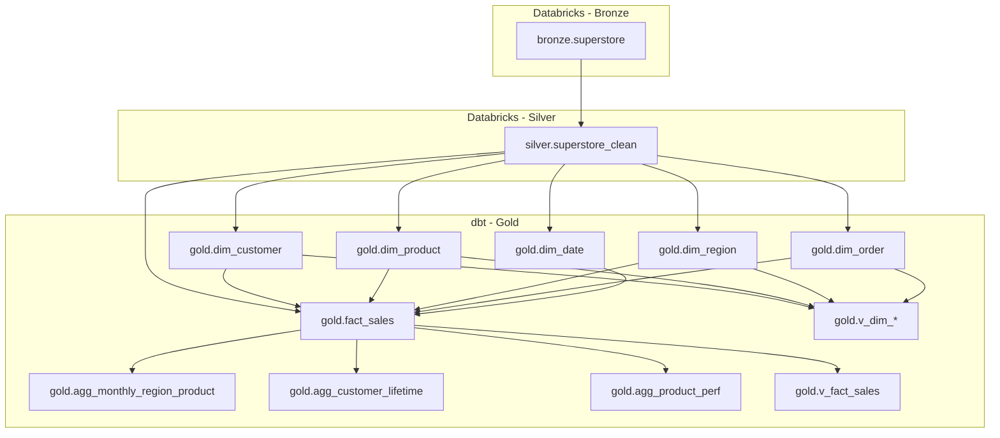

# Retail Sales Analytics & Forecasting

**Author:** NAGAMALLESWARA RAO ALAVALA  
**Date:** 11-02-2025

---

## Table of Contents
1. [Project Overview](#project-overview)
2. [Architecture & Data Flow](#architecture--data-flow)
3. [Data Lineage](#data-lineage)
4. [Conceptual Mapping to Retail Tables](#conceptual-mapping-to-retail-tables)
5. [Gold Layer Models](#gold-layer-models)
6. [ETL Summary](#etl-summary)
7. [Power BI Deliverables](#power-bi-deliverables)
8. [Next Steps (Planned)](#next-steps-planned)
9. [Notes](#notes)

---

## Project Overview

This project implements an end-to-end **retail sales analytics** pipeline using the Superstore dataset (Orders, Customers, Products, Regions). It provides a clean **star schema** for BI, performance-oriented **pre-aggregations**, and foundations for **forecasting** and a **Gen-AI chatbot**.

**Tech stack**
- **Databricks**: Medallion architecture (Bronze, Silver)  
- **dbt**: Gold dimensional models (dims, facts, views, aggs)  
- **Power BI**: Dashboards (sales trend, profit heatmap, customer analysis)  
- **(Planned)** ML forecasting (next-month sales) & Gen-AI Q&A

**Goal**: Deliver trustworthy, fast, and explainable retail insights across **regions**, **products**, and **customers**.

---

## 🧩 Architecture & Data Flow

### 🔹 Bronze (Raw)
- **Schema:** `bronze`
- **Table:** `superstore` (raw CSV → Delta)
- **Purpose:** Immutable landing of the Kaggle Superstore dataset

### 🔹 Silver (Clean)
- **Schema:** `silver`
- **Table:** `superstore_clean`
- **Purpose:** Typed, trimmed, deduped order lines + derived fields (`order_ym`, `ship_days`)

### 🔹 Gold (Analytics)
- **Schema:** `gold`
- **dbt models:** Dimensions, fact table, views, and pre-aggregations for BI

---

## 🧭 Data Lineage

## 🧠 Conceptual Mapping to Retail Tables

| Conceptual Table | Implemented In                                           | Description                                                  |
|------------------|-----------------------------------------------------------|--------------------------------------------------------------|
| **Orders**       | `dim_order`, `fact_sales`                                 | Order header (dates, ship info) and line-level measures.     |
| **Customers**    | `dim_customer`, `agg_customer_lifetime`                   | Customer details, segment, and lifetime value metrics.       |
| **Products**     | `dim_product`, `agg_product_perf`                         | Product catalog with Category/Sub-Category hierarchy.        |
| **Regions**      | `dim_region`, `agg_monthly_region_product`                | Country/Region/State/City/Postal rolled for reporting.       |
| **SalesFacts**   | `fact_sales`                                              | Line-grain sales/profit/discount/quantity with FKs to dims.  |

## 🧱 Gold Layer Models

| Layer         | Model                          | Type  | Description                                                                 |
|---------------|--------------------------------|-------|-----------------------------------------------------------------------------|
| **Dimension** | `dim_date`                     | Table | Calendar table (year, quarter, month, YM, weekday, etc.).                   |
| **Dimension** | `dim_customer`                 | Table | Customer attributes (name, segment).                                        |
| **Dimension** | `dim_product`                  | Table | Product attributes (category, sub_category, name).                          |
| **Dimension** | `dim_region`                   | Table | Geography rolled to reporting grain (country/region/state/city/postal).     |
| **Dimension** | `dim_order`                    | Table | Order header, ship mode, `ship_days`, bucketed `ship_speed`.                |
| **Fact**      | `fact_sales`                   | Table | Line-level sales metrics with FKs to dims.                                  |
| **Agg**       | `agg_monthly_region_product`   | Table | Monthly Region × Category × Sub-Category (trends/heatmaps).                 |
| **Agg**       | `agg_customer_lifetime`        | Table | First/last order, orders, units, sales, profit, margin by customer.         |
| **Agg**       | `agg_product_perf`             | Table | Product rollups with orders, sales, profit, units, margin.                  |
| **View**      | `v_dim_*`, `v_fact_sales`      | View  | Thin views over tables for governed BI access.                              |

## ⚙️ ETL Summary

| Layer   | Platform    | Key Tasks                                                                                              |
|---------|-------------|---------------------------------------------------------------------------------------------------------|
| Bronze  | Databricks  | Load raw CSV → Delta (truncate & load for this project).                                                |
| Silver  | Databricks  | Clean types, safe-cast numerics, trim text, dedupe, derive `order_ym`/`ship_days`.                      |
| Gold    | dbt + Delta | Build dims/fact with **surrogate keys** via `row_number()` on stable hashes; create views & aggregations.|

## 📊 Power BI Deliverables

### Model
Relate `fact_sales` to:
- `dim_date` (via `order_date` → `date`)
- `dim_customer` (via `customer_sk`)
- `dim_product` (via `product_sk`)
- `dim_region` (via `region_sk`)
- `dim_order` (via `order_sk`)

### Core Measures (DAX)
- **Sales** = `SUM(fact_sales[sales])`
- **Profit** = `SUM(fact_sales[profit])`
- **Units** = `SUM(fact_sales[quantity])`
- **Orders** = `DISTINCTCOUNT(fact_sales[order_id])`
- **Margin %** = `DIVIDE([Profit], [Sales])`
- **AOV** = `DIVIDE([Sales], [Orders])`
- **Sales LY** = `CALCULATE([Sales], DATEADD(dim_date[date], -1, YEAR))`
- **Sales YoY %** = `DIVIDE([Sales] - [Sales LY], [Sales LY])`
- **Rolling 12M Sales** = `CALCULATE([Sales], DATESINPERIOD(dim_date[date], MAX(dim_date[date]), -12, MONTH))`

### Pages
**Overview**
- KPI cards: Sales, Profit, Margin %, Orders, Units, AOV
- Line: Monthly trend (Sales / Profit or Rolling 12M Sales)
- Bar: Sales by Category
- Map/Bar: Sales by Region
- Slicers: Year/Month, Region, Category, Segment

**Profitability**
- Matrix/Heatmap: Region × Category (color by Margin % or Profit)
- Bar: Top products by Profit (Top N)

**Customers**
- Table: Lifetime metrics (from `agg_customer_lifetime`) → First/Last Order, Orders, Units, Sales, Profit, Margin %
- Bar: Sales by Segment
- Slicer: Customer / Segment

**Shipping**
- Bar: Ship Mode vs Margin %
- Column: Ship Speed Bucket vs Profit
- Card: Avg Ship Days

---

## 🚀 Next Steps (Planned)

**Forecasting**
- Train a regression model to predict **next-month sales** (overall or by Region × Category).

**Classification**
- Optional model to flag **profitable vs. risky orders**.

**Gen-AI Chatbot**
- Natural-language Q&A on the Gold layer (e.g., “Show sales in West for Q4 2017”).

**CI/CD**
- dbt tests in CI, automated deployments, and scheduled Power BI refresh.

---

## 🧾 Notes

- **Surrogate Keys**: Integer SKs via `row_number()` over stable hashes ensure deterministic keys for dims/fact.
- **Testing**: dbt tests (`not_null`, `unique`, `relationships`) guard model integrity.
- **Performance**: Use **Import** or **Composite** models in Power BI; **agg_*** tables accelerate common visuals.
- **Governance**: Expose BI via `v_*` views when you need fine-grained permissions.
