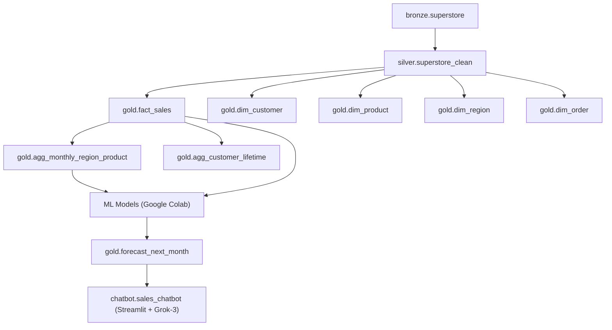

# 🛒 Retail Sales Analytics & Forecasting  

**Repository:** `nalavala999/retail_sales_analytics_and_forecasting`  
**Author:** Nagamalleswara Rao Alavala  
**Date:** 2025-11-09  

---

## 📘 Table of Contents
1. [Project Overview](#project-overview)  
2. [Architecture & Data Flow](#architecture--data-flow)  
3. [Data Lineage](#data-lineage)  
4. [Conceptual Mapping to Retail Tables](#conceptual-mapping-to-retail-tables)  
5. [Gold Layer Models](#gold-layer-models)  
6. [ETL Summary](#etl-summary)  
7. [Power BI Deliverables](#power-bi-deliverables)  
8. [Machine Learning Models (Google Colab)](#machine-learning-models-google-colab)  
9. [Gen-AI Chatbot (Retail Sales Assistant)](#gen-ai-chatbot-retail-sales-assistant)  
10. [Repo Structure](#repo-structure)  
11. [Next Steps](#next-steps)  
12. [Dataset & Credits](#dataset--credits)  

---

## 🧩 Project Overview  
An end-to-end **Retail Sales Analytics & Forecasting** pipeline built using the **Kaggle Superstore dataset**.  
Implements the **Medallion Architecture (Bronze → Silver → Gold)** in **Databricks + dbt**, visualized through **Power BI**, enhanced with **ML models in Google Colab**, and extended with a **Gen-AI Chatbot powered by Grok-3** for conversational analytics.

---

## 🧱 Architecture & Data Flow  

| Layer | Platform | Schema | Description |
|-------|-----------|---------|-------------|
| **Bronze** | Databricks | `bronze` | Raw CSV ingestion → Delta tables |
| **Silver** | Databricks | `silver` | Cleaned + standardized records |
| **Gold** | dbt | `gold` | Dimensional models (Facts + Dims + Aggregations) |
| **ML** | Google Colab | — | scikit-learn models for profit classification & sales forecasting |
| **BI** | Power BI | — | Interactive dashboards for business insights |
| **AI** | Streamlit + LangChain + Grok-3 | — | Retail Sales Chatbot with natural-language querying |

---

## 🧭 Data Lineage  



---

## 🧠 Conceptual Mapping to Retail Tables  

| Concept | Implemented In | Description |
|----------|----------------|-------------|
| **Orders** | `dim_order`, `fact_sales` | Order headers, dates, shipping modes |
| **Customers** | `dim_customer`, `agg_customer_lifetime` | Customer attributes & lifetime metrics |
| **Products** | `dim_product`, `agg_monthly_region_product` | Category hierarchy & sales performance |
| **Regions** | `dim_region`, `agg_monthly_region_product` | Country/Region-level insights |
| **SalesFacts** | `fact_sales` | Line-grain transactions with metrics |

---

## 🧱 Gold Layer Models  

| Type | Model | Description |
|------|--------|-------------|
| **Dimension** | `dim_date` | Calendar hierarchy |
| **Dimension** | `dim_customer` | Customer profile & segment |
| **Dimension** | `dim_product` | Product and subcategory metadata |
| **Dimension** | `dim_region` | Region, state, city information |
| **Fact** | `fact_sales` | Core sales metrics (Sales, Profit, Qty, Discount) |
| **Aggregate** | `agg_monthly_region_product` | Region × Category × Month trend metrics |
| **Aggregate** | `agg_customer_lifetime` | Lifetime KPIs (Orders, Profit, Margin%) |
| **ML Output** | `gold.forecast_next_month` | Regression results for forecasting |

---

## ⚙️ ETL Summary  

| Step | Description | Tools |
|------|--------------|-------|
| 1️⃣ **Raw Ingestion** | Import CSV → Bronze Delta | Databricks COPY INTO |
| 2️⃣ **Transformation** | Cleaning & standardization | PySpark |
| 3️⃣ **Modeling** | Star Schema via dbt | dbt |
| 4️⃣ **Validation** | Schema + relationship tests | dbt tests |
| 5️⃣ **Delivery** | Power BI dashboard build | Power BI Desktop |
| 6️⃣ **ML & AI** | Forecasting and chatbot insights | Google Colab + Streamlit |

---

## 📊 Power BI Deliverables  

| Page | Purpose | Key Visuals |
|------|----------|-------------|
| 🏠 **Executive Overview** | Summary KPIs | Total Sales, Profit, Orders, AOV |
| 🌍 **Region Performance** | Regional comparison | Map + Bar Charts |
| 📦 **Profitability & Mix** | Category-level profitability | Matrix (Region × Category) |
| 👥 **Customers** | Segment & LTV insights | Bar + Table Visuals |
| 🚚 **Shipping & Service** | Operational efficiency | Ship Mode vs Profit |
| 📅 **Date Trends** | Time-based trends | Line Charts – Monthly Sales/Profit |

### 📸 Dashboard Previews  
#### 🏠 Executive Overview


#### 🌍 Region Performance


#### 📦 Profitability & Mix


#### 👥 Customers


#### 🚚 Shipping & Service


#### 📅 Date Trends


---


## 🤖 Machine Learning Models (Google Colab)

[](https://colab.research.google.com/github/nalavala999/retail_sales_analytics_and_forecasting/blob/main/ML_Models/sales_forecast.ipynb)

**Notebook:** `sales_forecast.ipynb`  
**Dataset:** `Cleaned_Superstore.csv`

| Model | Type | Algorithm | Metric | Result |
|--------|------|------------|---------|---------|
| **Profitable Orders Classifier** | Classification | Logistic Regression / Random Forest | Accuracy | ≈ 92–94 % |
| **Next-Month Sales Forecast** | Regression | Linear / Gradient Boosting | R² | ≈ 0.78 |

**Highlights 📈**  
- Identified key drivers: `discount`, `ship_days`, `region`  
- Gradient Boosting showed strong correlation for forecasting  
- Output visualizations highlighted top performing regions and categories  

---

## 🤖 Gen-AI Chatbot (Retail Sales Assistant)

### Overview  
A **Streamlit + LangChain + Grok-3** based chatbot that connects to **Databricks SQL Warehouse**, reads the Superstore dataset, builds FAISS embeddings for contextual retrieval, and answers natural language queries about sales, profit, and customers.

### ⚙️ Architecture  

| Component | Description |
|------------|-------------|
| **Frontend** | Streamlit UI (`sales_chatbot.py`) |
| **LLM** | x.ai Grok-3 API |
| **Database** | Databricks SQL Warehouse (Gold Schema) |
| **Vector Store** | FAISS + SentenceTransformers Embeddings |
| **Framework** | LangChain for chunking & context retrieval |

### 📦 Data Source  
`retail_sales_analytics_and_forecasting.gold.fact_sales` joined with  
`dim_region`, `dim_product`, `dim_customer`, `dim_order` for human-readable context.

### 💬 Example Queries  
```
"Show total sales and profit in West region for 2017"
"Compare Furniture and Technology sales by region"
"Which customer segment had highest YoY growth?"
"List top 5 most profitable customers in the South region"
"Forecast next-month sales for Office Supplies category"
```

### 🧾 .env Configuration
```bash
XAI_API_KEY="xai-XXXXXXXXXXXXXXXXXXXX"
DATABRICKS_SERVER_HOSTNAME="adb-xxxxxx.azuredatabricks.net"
DATABRICKS_HTTP_PATH="/sql/1.0/warehouses/xxxxxxx"
DATABRICKS_ACCESS_TOKEN="dapi-XXXXXXXXXXXXXXXXXXXX"
```

### ▶️ Run Instructions
```bash
cd chatbot
streamlit run sales_chatbot.py
```

When launched, Streamlit UI loads data from Databricks, builds the FAISS index, and allows you to query sales analytics in plain English.

---

## 📂 Repo Structure  
```
retail_sales_analytics_and_forecasting/
│
├── data/
│   └── Cleaned_Superstore.csv
│
├── ML_Models/
│   ├── Cleaned_Superstore.csv
│   └── sales_forecast.ipynb
│
├── powerbi/
│   ├── Retail_Sales.pbix
│   └── assets/
│       ├── Executive_Overview.png
│       ├── Region_Performance.png
│       ├── Profitability_Mix.png
│       ├── Customers.png
│       ├── Shipping_Service.png
│       └── Date_Trends.png
│
├── chatbot/
│   ├── .env
│   └── sales_chatbot.py
│
└── README.md
```

---

## 🔮 Next Steps  
- Add Power BI embedding for chatbot responses  
- Extend LLM with retrieval-augmented generation (RAG)  
- Automate daily data refresh and FAISS index rebuilds  
- Deploy chatbot as Azure Web App or Streamlit Cloud  

---

## 📚 Dataset & Credits  
- **Dataset:** [Kaggle — Superstore Dataset](https://www.kaggle.com/datasets/vivek468/superstore-dataset-final)  
- **Tools:** Databricks, dbt, Power BI, Google Colab, scikit-learn, Streamlit, LangChain, Grok-3  
- **Developed by:** *Nagamalleswara Rao Alavala (2025)*  
